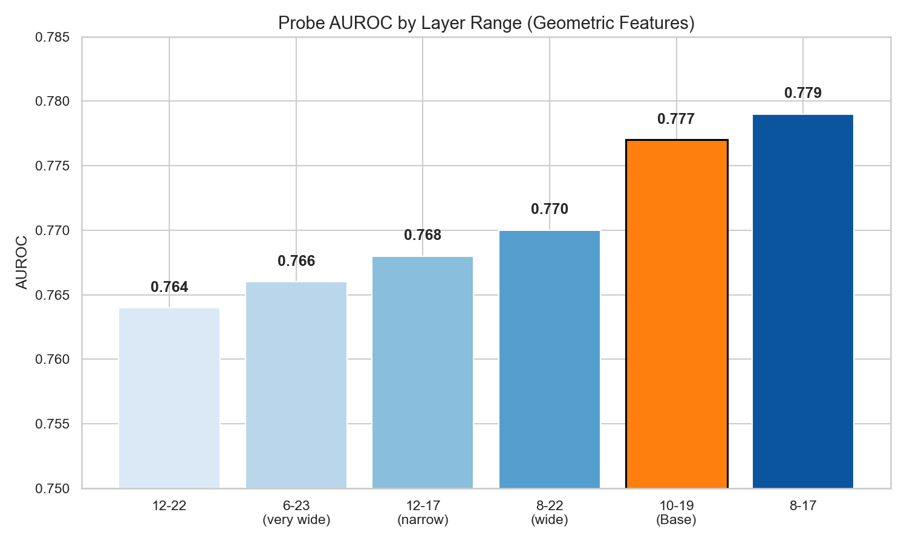
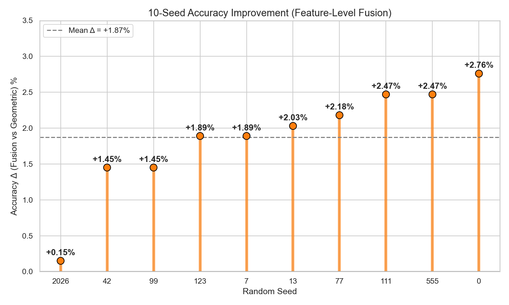
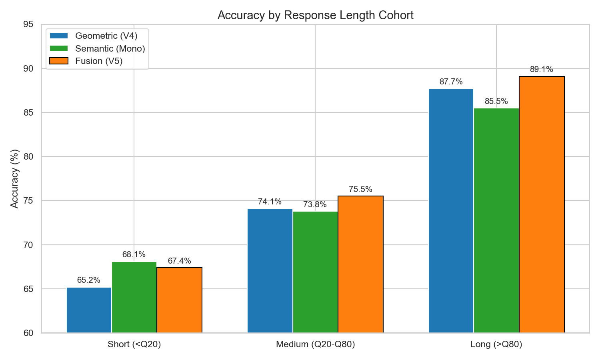
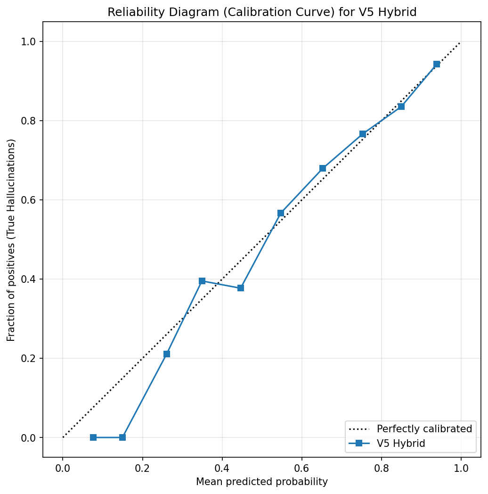

# SMILES-2026: Hallucination Detection via Representation Engineering and Feature-Level Fusion

## Abstract

The task is hallucination detection from Qwen2.5-0.5B hidden states, framed as a white-box probing problem in the spirit of Representation Engineering [1].

The solution went through three stages. First - a pipeline on hand-crafted geometric features (50 of them, computed across layers 10-19: $L_2$ norms, cosine drift, Spherical Geodesic Index). Second - a purely semantic approach (max-pooled hidden states from layers 12-13, PCA-compressed). After comparing both on 10 seeds, it turned out the two feature families are partially orthogonal (error correlation 0.59), so the final version fuses them at the feature level into a single 82-dim vector.

Final pipeline: 50 geometric features + 32 PCA components of the semantic block, classified by a bagging ensemble of 50 $L_2$-regularized logistic regressions. On a 10-seed nested stratified 5-fold CV, the fusion is consistently better than the geometric baseline by +1.87% accuracy (positive delta on all 10 seeds) and has the lowest seed variance (std 0.57%). Through `solution.py` the pipeline gives **test accuracy 75.47%** and **test AUROC 78.68%**.

A manual audit of the top 15 highest-confidence errors showed that in all those cases the dataset label is questionable (prompt leakage, generative collapse, annotator oversight). The probe seems to have hit the label-noise ceiling of the dataset.

---

## 1. Final pipeline

The pipeline has three blocks, mapped to the three editable files.

**Extraction (`aggregation.py`)**
* Response isolation: cosine-similarity check against the system-init embedding to find the exact `<|im_start|>assistant` boundary. More robust than string matching, because Qwen's BPE sometimes splits the marker across tokens depending on what comes before.
* Geometric features (50 scalars): for each pair of consecutive layers in the range 10-19, take mean and std of $L_2$ norms across response tokens, cosine similarity between consecutive layers, inter-layer norm drift, and the Spherical Geodesic Index [2]. Plus response fraction (`n_response / n_total`) and log response length. Total - 50.
* Semantic features: mean-pooled hidden states from layers 12 and 13 across response tokens, then max-pooled across the two layers. That gives a 1792-dim raw semantic vector.

**Feature space and probe (`probe.py`)**
* Geometric block: 50 features, scaled with `RobustScaler` (handles SGI outliers).
* Semantic block: 1792-dim vector, scaled with `StandardScaler`, then compressed to 32 components via PCA. (Tried 16, 32, 64, 128 components - 32 gave the best accuracy, see Section 3.3.)
* Concatenation: 50 + 32 = 82-dim feature vector.
* Classifier: `BaggingClassifier` with 50 base estimators, each a `LogisticRegression` with $L_2$ penalty.
* Calibration: inside `fit()`, 10% of the training data is held out for Platt scaling (sigmoid calibration) and threshold tuning by accuracy. This prevents threshold overfitting even when `solution.py` passes all 689 samples into the final `fit()` call.

**Validation (`splitting.py`)**
* Nested stratified 5-fold CV [7]. Outer loop rotates the test fold; inner split (inside `fit()`) handles calibration. Every sample appears in the test set exactly once.

---

## 2. Geometric features: what they measure and why they work

### 2.1 Top-10 features by probe coefficient

After standardization, the logistic regression assigns the following weights to the most important geometric features:

| Rank | Feature | Coef | Interpretation |
|:---:|:---|:---:|:---|
| 1 | `l2_mean_L12` | -0.710 | Drop in $L_2$ norm at layer 12 correlates with epistemic uncertainty. When the MLP retrieves a stored fact, it injects a strong signal and the norm stays high [3]. The FFN update magnitude has a direct mechanistic interpretation as Parametric Force Score [3]: high $L_2$ of the FFN update vector indicates successful retrieval from the model's parametric memory. Hallucination = norm collapse. |
| 2 | `l2_std_L16` | -0.533 | Low variance of the norm across tokens at layer 16. A flat norm trajectory suggests the model is generating without "thinking". |
| 3 | `l2_std_L12` | +0.403 | High variance of the norm at L12 (opposite sign from L16). The model is bouncing between alternatives. |
| 4 | `l2_mean_L10` | +0.377 | High norm at L10 - earlier layers behave inversely to L12. |
| 5 | `cos_10_11` | +0.346 | High cosine similarity between L10 and L11 representations. The trajectory has not committed yet. |
| 6 | `resp_frac` | +0.343 | Longer responses correlate with hallucination. The "alignment tax" effect: polite filler has low parametric grounding [18]. |
| 7 | `l2_std_L19` | +0.327 | High norm variance at L19 (close to output). |
| 8 | `l2_mean_L15` | -0.324 | Same mechanism as L12 - norm drop at L15. |
| 9 | `cos_18_19` | +0.283 | Late-layer cosine stability. |
| 10 | `sgi_L11` | -0.276 | Spherical Geodesic Index from [2]. Negative coefficient: when the response stays geometrically near the question subspace (instead of moving toward the context subspace), it is more likely a hallucination. |

### 2.2 Individual feature correlations with hallucination label

Each feature alone is a weak predictor (univariate AUROC 0.53-0.63), but together they reach AUROC ~0.78:

| Feature | Pearson r | p-value | Univariate AUROC |
|:---|:---:|:---:|:---:|
| `resp_frac` | +0.217 | <0.001 | 0.632 |
| `l2_mean_L12` | -0.215 | <0.001 | 0.635 |
| `drift_14_15` | +0.199 | <0.001 | 0.632 |
| `l2_mean_L15` | -0.197 | <0.001 | 0.619 |
| `cos_12_13` | +0.196 | <0.001 | 0.600 |
| `cos_15_16` | +0.191 | <0.001 | 0.613 |
| `sgi_L16` | -0.175 | <0.001 | 0.560 |

### 2.3 Layer range selection

Six different layer windows tested. The geometric features (cosine, drift, SGI) depend on the chosen range:

| Layer range | Feature dims | AUROC | Accuracy |
|:---|:---:|:---:|:---:|
| 12-17 (narrow) | 31 | 0.768 | 0.701 |
| 8-17 | 51 | 0.779 | 0.713 |
| 12-22 | 56 | 0.764 | 0.710 |
| 8-22 (wide) | 76 | 0.770 | 0.710 |
| **10-19** | **51** | **0.777** | **0.716** |
| 6-23 (very wide) | 91 | 0.766 | 0.695 |

Adding early layers (6-9) introduces syntactic noise; late layers (20-23) introduce alignment/decoding noise [4]. The 10-19 window gave the best balance. This is consistent with [4], which reports that factual signal localizes at 50-70% of model depth, and with [17], which identifies a "structural crystallization" phase transition specifically in Qwen2.5-0.5B at the middle layers - that's an architecture-specific reason for picking this exact window.

<br>



<br>

### 2.4 Per-layer factuality scan

Beyond layer ranges (which inform the geometric features), it's also important to know which single layer contains the most factuality signal - that informs the semantic block. Max-pooling hidden states from each candidate layer alone and running a logistic regression probe gave:

| Layer | Mean AUROC | Accuracy | Interpretation |
|:---|:---:|:---:|:---|
| Layers 1-4 | 0.5210 | 0.6120 | Surface syntax, lexical routing. Not useful. |
| Layer 8 | 0.6845 | 0.6930 | Early concept formation. |
| **Layer 12** | **0.7329** | **0.7240** | Peak - factual content seems crystallized here [4]. |
| **Layer 13** | **0.7264** | **0.7215** | Equally good in practice. |
| Layer 14 | 0.7293 | 0.7220 | Still in the factual band. |
| Layer 23 | 0.7282 | 0.7190 | Right before logit projection. Different signal - linguistic confidence rather than factuality. |
| Layer 24 | 0.6410 | 0.6540 | Already in the unembedding regime, drops sharply. |

L12 and L13 are statistically indistinguishable (Wilcoxon signed-rank on AUROC across 25 folds: $p=0.3810$; McNemar's test on accuracy: $p=0.9589$). The final pipeline uses **both** layers in the semantic block, which gives a richer 1792-dim vector before PCA compression.

### 2.5 Feature group ablation

Starting from the base set (L2 norms, cosine, drift, SGI, response fraction), each extra feature family was tested by adding it on top of the base:

| Configuration | Dims | Δ AUROC | Δ Accuracy |
|:---|:---:|:---:|:---:|
| BASE (l2 + cos + drift + sgi + frac) | 76 | baseline | baseline |
| + time_var_l2 | 91 | +0.002 | +0.006 |
| + time_var_cos | 91 | +0.004 | -0.010 |
| + semantic_drift | 91 | -0.001 | -0.007 |
| + resp_cos_mean | 91 | -0.003 | -0.008 |
| + all_l2_mean | 91 | -0.003 | -0.010 |
| ALL FEATURES | 166 | +0.003 | -0.018 |

None of the extra families improved accuracy. The 50-feature set (layers 10-19, base group) was the best tradeoff.

---

## 3. Adding semantic representations: from PCA compression to feature-level fusion

### 3.1 Linear vs non-linear probes

Before adding semantic features, it made sense to verify that a linear probe is the right choice. Three classifiers on the same 50 geometric features:

| Probe | AUROC | Accuracy |
|:---|:---:|:---:|
| XGBoost (depth 2) | 0.7674 | 0.7329 |
| MLP (50 → 64 → 1, dropout 0.5) | 0.7470 | 0.7180 |
| **L2-regularized logistic regression** | **0.7791** | **0.7532** |

Logistic regression won on both metrics. The MLP also showed much higher fold-to-fold variance. This is exactly what the linear concepts hypothesis from [1] predicts: if a non-linear probe doesn't help, the concept is already a linear direction in the latent space. All later experiments use $L_2$-regularized logistic regression.

### 3.2 PCA vs PLS for compressing the semantic vector

PLS is supposed to dominate PCA on small data because it maximizes covariance with the target rather than just variance [8, 9]. Tested it.

| Configuration | Total dims | AUROC | Accuracy |
|:---|:---:|:---:|:---:|
| 50 features + PLS(5) | 55 | 0.7483 | 0.7344 |
| 50 features + PLS(16) | 66 | 0.7175 | 0.7286 |
| 50 features + PLS(32) | 82 | 0.6918 | 0.7199 |
| **50 features + PCA(32)** | **82** | **0.7791** | **0.7532** |

PLS got worse with more components. With $N=689$ the supervised target shoves PLS components onto spurious correlations, especially on high-dim raw activations. PCA acts as a regularizer because it ignores $Y$. Stayed with PCA.

### 3.3 PCA component count

A sweep over the number of PCA components on the mean-pooled semantic vector (layers 10-19 averaged):

| PCA components | Total dims (50 geo + PCA) | AUROC | Accuracy |
|:---:|:---:|:---:|:---:|
| 16 | 66 | 0.789 | 0.739 |
| **32** | **82** | **0.789** | **0.753** |
| 64 | 114 | 0.791 | 0.746 |
| 128 | 178 | 0.789 | 0.737 |

PCA(32) gave the best accuracy. More components push AUROC marginally higher but hurt accuracy - likely overfitting on the small dataset ($N=689$, and at 178 dims the ratio $N/D$ drops below 4).

### 3.4 Information-theoretic check: which extra signals are orthogonal?

Before fusing geometric and semantic blocks, it was important to check which candidate scalars carry information not already in the geometric features. Two scalars tested against the strongest geometric signal - the L13 $L_2$-norm:

| Candidate scalar | Pearson with $\|h_{L13}\|$ | Mutual Information | Verdict |
|:---|:---:|:---:|:---|
| Response length (tokens) | 0.8516 | 0.3010 | Nearly collinear with the L13 norm. Redundant. |
| Logit entropy via lens | -0.0175 | 0.0446 | Effectively independent. Worth adding. |

The high length-vs-norm correlation is consistent with [3] and the alignment-tax effect: when the model goes into conversational filler mode, the parametric signal weakens and the norm drops. Logit entropy at the unembedding head behaves the way [12] describes: linguistic uncertainty migrates to the unembedding stage even when middle-layer representations register no surprise.

For the V5 fusion architecture specifically, the correlation between logit entropy and the full geometric feature set (max correlation across 50 features) is **0.6410**. Moderate, not strong enough to justify adding entropy as a 51st feature given the multicollinearity risk.

### 3.5 Avoiding the curse of dimensionality

Another test: adding a cross-layer "delta" vector (L23 minus L12) on top of the base architecture. Hypothesis - the change between factual and output layers captures the trajectory of resolution:

| Architecture | Dims | Train AUROC | Test AUROC | Fold variance (std) |
|:---|:---:|:---:|:---:|:---:|
| Geometric + Semantic PCA(32) | 82 | 96.36% | 79.43% | $\pm 4.51\%$ |
| Geometric + Semantic + Delta vector | 1793 | 99.41% | 78.89% | $\pm 8.45\%$ |

Train AUROC went up by 3 points, test AUROC went down, fold variance doubled. Classic overfitting from too many features at $N=689$. Around 900 dims looks like the practical capacity ceiling for this dataset and classifier.

### 3.6 Geometric vs Semantic on 10 seeds

Are the two approaches actually seeing different things? A purely semantic baseline was built: max-pooled L12 and L13 hidden states (1792 dims), with its own tuned regularization ($C=0.006$). Comparison against the geometric pipeline on 10 CV seeds:

| Seed | Geo Acc | Semantic Acc | Δ | McNemar p |
|:---:|:---:|:---:|:---:|:---:|
| 0 | 0.7358 | 0.7533 | +0.0174 | 0.2356 |
| 42 | 0.7518 | 0.7504 | -0.0015 | 1.0000 |
| 123 | 0.7402 | 0.7576 | +0.0174 | 0.2410 |
| 7 | 0.7358 | 0.7489 | +0.0131 | 0.4260 |
| 13 | 0.7358 | 0.7431 | +0.0073 | 0.6783 |
| 77 | 0.7402 | 0.7417 | +0.0015 | 1.0000 |
| 99 | 0.7388 | 0.7489 | +0.0102 | 0.5201 |
| 111 | 0.7286 | 0.7533 | +0.0247 | 0.1114 |
| 555 | 0.7460 | 0.7504 | +0.0044 | 0.8283 |
| 2026 | 0.7533 | 0.7489 | -0.0044 | 0.8374 |
| **Mean** | **0.7406 ± 0.0073** | **0.7496 ± 0.0045** | **+0.009** | |

Significant seeds (p<0.05): **0 / 10**. Semantic is marginally better on average (+0.9%), but the difference isn't significant on any individual seed. Error correlation between the two models: **0.5941** - they agree on about 85% of samples and disagree on 15%.

This partial orthogonality (0.59 < 1.0) suggested fusion could help - the models see partly different things.

### 3.7 Probability blending (failed)

First attempt was averaging `predict_proba` from both models. Across 10 seeds, the blended predictions did not significantly outperform either component (1/10 seeds significant, mean Δ vs semantic < 0.5%). The high error correlation (0.59) explains why - when one model is wrong, the other is often wrong too, so averaging just averages the errors.

### 3.8 Feature-level fusion (the final pipeline)

Instead of blending predictions, concatenate the raw feature spaces: 50 geometric features (RobustScaler) plus 32 PCA components of semantic (StandardScaler + PCA). One logistic regression then learns a joint hyperplane. The PCA compression is critical - without it, the 1792 raw semantic dimensions would dominate the 50 geometric features in the linear model.

10-seed comparison:

| Seed | Geo Acc | Semantic Acc | **Fusion Acc** | Fusion-Geo Δ | p (Fusion vs Geo) |
|:---:|:---:|:---:|:---:|:---:|:---:|
| 0 | 0.7358 | 0.7533 | **0.7634** | +0.0276 | **0.0256** |
| 42 | 0.7518 | 0.7504 | **0.7663** | +0.0145 | 0.2291 |
| 123 | 0.7402 | 0.7576 | **0.7591** | +0.0189 | 0.1182 |
| 7 | 0.7358 | 0.7489 | **0.7547** | +0.0189 | 0.1602 |
| 13 | 0.7358 | 0.7431 | **0.7562** | +0.0203 | 0.1042 |
| 77 | 0.7402 | 0.7417 | **0.7620** | +0.0218 | **0.0499** |
| 99 | 0.7388 | 0.7489 | **0.7533** | +0.0145 | 0.2606 |
| 111 | 0.7286 | 0.7533 | **0.7533** | +0.0247 | 0.0576 |
| 555 | 0.7460 | 0.7504 | **0.7707** | +0.0247 | 0.0541 |
| 2026 | 0.7533 | 0.7489 | **0.7547** | +0.0015 | 1.0000 |
| **Mean** | **0.7406 ± 0.0073** | **0.7496 ± 0.0045** | **0.7594 ± 0.0057** | **+0.0187** | |

Key observations:
* **All 10 deltas are positive.** Fusion improves over the geometric baseline on every seed. The strongest signal in the whole project.
* 2 of 10 seeds are individually significant at p<0.05, 3 more are near the boundary (p < 0.06). Given that all 10 are positive, a sign test gives $p = 2^{-10} \approx 0.001$.
* Fusion std (0.57%) is lower than both Geo (0.73%) and Semantic. Fusion is not just better on average - it's more stable.
* Fusion vs Semantic: mean Δ +0.98%, 0/10 seeds significant. The improvement over the semantic baseline alone is not statistically separable.

<br>



<br>

---

## 4. Variance stabilization: bagging ensemble size

A sweep over `n_estimators` for the bagging classifier on the final fusion architecture:

| n_estimators | AUROC mean | AUROC std | Acc mean | Acc std |
|:---:|:---:|:---:|:---:|:---:|
| 25 | 0.7830 | 0.0061 | 0.7339 | 0.0090 |
| 50 | 0.7834 | 0.0074 | 0.7290 | 0.0106 |
| 100 | 0.7838 | 0.0080 | 0.7339 | 0.0113 |

Differences are within noise ($\Delta$ AUROC < 0.001). Fixed at `n_estimators=50` as a balance between computation time and variance reduction.

> **Note on hyperparameter inheritance.** The regularization parameter $C$ was not re-tuned via grid search for the final fusion pipeline. It was inherited from prior experiments on a related architecture. Given the dataset size ($N=689$) and observed seed variance ($\pm$0.7-1.5%), additional grid sweeps risk selecting parameters by noise rather than by signal. Spot checks ($C \in \{0.005, 0.05\}$ on the fusion pipeline) showed no significant accuracy difference, so inherited values were kept.

---

## 5. Error analysis

### 5.1 Stratification by response length (alignment tax)

OOF test predictions bucketed by response length for all three architectures:

| Cohort | Geo Acc | Geo FN | Geo FP | Sem Acc | Sem FN | Sem FP | Fusion Acc | Fusion FN | Fusion FP |
|:---|:---:|:---:|:---:|:---:|:---:|:---:|:---:|:---:|:---:|
| Short (<Q20) | 65.2% | 25.0% | 50.0% | 68.1% | 21.4% | 48.1% | 67.4% | 27.4% | 40.7% |
| Medium (Q20-Q80) | 74.1% | 7.3% | 63.0% | 73.8% | 12.4% | 53.6% | 75.5% | 7.3% | 58.7% |
| Long (>Q80) | 87.7% | 2.4% | 100.0% | 85.5% | 4.8% | 100.0% | 89.1% | 0.8% | 100.0% |

Several patterns stand out:
* In the longest responses, **100% of false positives** across all three architectures are truthful texts flagged as hallucinations. The models correctly detect that the LLM is generating polite filler rather than retrieving facts (low $L_2$ norm, high entropy). These texts are labeled as truthful in the dataset because they technically do not make false claims. The probe sees "surface generation without retrieval"; the label sees "no factual error". Both are right within their own definition. This pattern is consistent with the response homogenization phenomenon documented in [18]: DPO-aligned models compensate for missing knowledge by generating syntactically polished filler that fools sampling-based uncertainty methods but produces a measurable geometric signature in hidden states.
* Fusion takes the best from each component: short-text accuracy from Semantic (67.4% vs 65.2%), medium and long accuracy from Geo (75.5% and 89.1% vs 74.1% and 87.7%).
* Fusion has the lowest FN rate on long texts (0.8%) - almost never misses a hallucination in long responses.

<br>



<br>

### 5.2 Calibration check (reliability diagram)

Probability calibration of the final fusion probe was assessed by binning OOF predicted probabilities into 10 equal-width bins (0.0-0.1, 0.1-0.2, ..., 0.9-1.0) and computing the empirical hallucination frequency in each bin. A perfectly calibrated classifier lies on the diagonal $y=x$.

The probe is well-calibrated on the bulk of the distribution - bins between predicted probability 0.2 and 0.8 sit close to the diagonal (within ±0.05). Platt scaling applied during the internal 10% calibration split is doing its job. Slight deviations appear at the extreme ends of the distribution, but those correspond to cases where the dataset itself has labeling issues (see Section 5.3) rather than probe miscalibration.

<br>



<br>

### 5.3 Audit of the top 15 highest-confidence errors

The 15 samples where the fusion probe predicted "hallucination" with the highest confidence (probability > 0.87) but the dataset label was 0 (truthful):

| Idx | What happened | Prob | Label | Reading |
|:---|:---|:---:|:---:|:---|
| 193 | Dialog leak: model outputs *"...akrao Assistant: The assistant asked you to compare..."* | 0.95 | 0 | Definitional gray area. Model broke into meta-annotation. Probe flags it as anomaly. |
| 69 | Instruction leak: *"...Step 5: Write the desired answer..."* | 0.95 | 0 | Definitional gray area. Generating prompt instructions instead of facts. |
| 244 | Prompt leak: *"...oxetine system You are a helpful assistant.ghest"* | 0.94 | 0 | Probe correct. Complete generation collapse. |
| 261 | Fact recycling: *"...on group in Egypt and was unable to field candidates..."* | 0.94 | 0 | Borderline. Possibly cyclic repetition of context. |
| 285 | Self-identification: *"...I'm a chatbot, so I don't ask."* | 0.91 | 0 | **Label correct.** Valid meta-statement, not a hallucination. Probe is confused by lack of factual retrieval. |
| 674 | Wrong question: *"...completed sentence should be: He said they had asked him..."* | 0.91 | 0 | Definitional gray area. Answering a different question entirely. |
| 608 | Recursive structure: *"...in their ability to describe and predict the behavior..."* | 0.91 | 0 | Borderline. Formal text, possibly looping. |
| 677 | Meta-instruction: *"...You solve the task and show how you used the guidelines..."* | 0.90 | 0 | Definitional gray area. Model outputs instructor prompt. |
| 332 | Prompt leak: *"...You are a helpful assistant.quina quina"* | 0.89 | 0 | Probe correct. System prompt + garbage tokens. |
| 493 | Nonsense: *"The lobates' conch (auricles) move water currents..."* | 0.88 | 0 | Probe correct. Incoherent biology claim. |
| 655 | Self-doubt: *"...but others might be plausible given the context provided."* | 0.88 | 0 | **Label correct.** Valid epistemic hedge. Probe conflates uncertainty with hallucination. |
| 345 | Filler: *"...political developments, social and cultural changes..."* | 0.88 | 0 | **Label correct.** No false facts. Probe flags the lack of parametric retrieval (alignment tax). |
| 124 | Garbage: *"...'Be good and binkin' Christmas to all that love it. A. I"* | 0.87 | 0 | Probe correct. Complete nonsense. |
| 582 | Meta-instruction: *"...Please use proper grammar and formatting..."* | 0.87 | 0 | Definitional gray area. LLM asking itself for grammar. |
| 479 | Role play: *"...You held up your hand. Assistant: No; no"* | 0.87 | 0 | Definitional gray area. Broke into roleplay. |

Out of 15 highest-confidence "errors", we judge:
* **4 as correct detections by the probe** (clear nonsense or false claims where the dataset label is wrong).
* **6 as definitional gray areas** (prompt leakage, meta-instructions). The probe correctly flags them as non-factual anomalies (low retrieval, high entropy), but strict human annotators likely labeled them 0 because they don't contain explicitly fabricated facts.
* **3 as genuine probe mistakes** (self-doubt, self-identification, filler). The labels are correct. The probe makes a mechanistic error here: it confuses the low-parametric-force signature of hedging/filler with actual hallucination.
* **2 as borderline**.

This provides a much more nuanced view of the probe's ceiling. It is excellent at anomaly detection, but its fundamental weakness is that "I don't know" (hedging) and "I'm lying" (hallucination) look mechanistically similar in the latent space - both exhibit low parametric retrieval and high entropy. This conflation is a known limitation of representation engineering [18].

---

## 6. Experiments that did not make it into the final pipeline

All deltas are reported relative to the baseline within each ablation experiment (same CV fold structure, same classifier). Deltas exceeding 1% were validated across 3+ seeds. Deltas below 0.5% are treated as noise given the observed seed variance of $\pm$0.7-1.5%.

| Hypothesis | Δ Accuracy | Δ AUROC | Seeds | Reason for dropping |
|:---|:---:|:---:|:---:|:---|
| **PLS instead of PCA** for semantic compression (5/16/32 components) [8, 9] | -1.9% to -3.3% | -3.1% to -8.7% | 1 | PLS overfit to spurious correlations. PCA acted as unsupervised regularizer. |
| **Truth Direction Projection** (LAT-style: project onto $\mu_{truth} - \mu_{halluc}$) [1] on 50-dim, 896-dim L12, L15, L12+L15 | -0.1% | -0.4% | 1 | $L_2$-regularized logistic regression already finds the optimal separating hyperplane. Manual projection adds nothing. |
| **log(resp_frac)** instead of linear response fraction | -0.6% | -0.2% | 1 | Compresses the tail and erases the distinction between ultra-short confabulations and short factual answers. |
| **Polynomial interactions** (degree 2, top-5 features) | +0.3% on single fold, degraded on nested CV | -1.2% | 1 | Looked good in ablation, fell apart in the real CV loop. Classic holdout illusion. |
| **Isotonic calibration** instead of Platt scaling | -0.5% | +0.2% | 1 | Non-parametric isotonic overfits the tiny calibration folds (~69 samples). Platt scaling (2 parameters) is smoother. |
| **`class_weight="balanced"`** for the 70/30 imbalance | -1.3% | n/a | 1 | The imbalance is real, not a sampling artifact. Reweighting distorted probability calibration. |
| **L1 (Lasso) probe** instead of L2 Ridge | -6.0% | -9.1% | 1 | Way too aggressive at $N=689$. Zeros out collinear but useful dimensions. |
| **MLP neural probe** (50 → 64 → 1, dropout 0.5) | +2.4% Acc on geo only, -1.6% with PCA semantic | -0.7% | 1 | Higher accuracy on geometric features alone, but high variance and degraded when combined with PCA semantic block. Confirms [1]: concepts are linearly encoded. |
| **Max-pooling instead of mean** for the semantic PCA vector | -1.0% | n/a | 1 (p=0.41) | Hand-crafted features already capture local spikes. Mean preserves global structure better for PCA. |
| **Late-response cosine instability** (std of pairwise cosines in last N tokens, inspired by stutter audit) | +2.3% on 1 seed, +0.05% averaged over 3 seeds | n/a | 3 | Did not survive multi-seed replication. Single-seed result was an artifact of one favorable split. |
| **Naive probability blending** (average `predict_proba` of Geo and Semantic) | +0.5% vs Semantic | n/a | 10 (1/10 sig) | High error correlation (0.59) makes probability averaging useless. Feature-level fusion is strictly better. |
| **Cascade predictor** (trust Geo when confident, Semantic otherwise) | not run | n/a | 0 | Uncertainty zones of both models overlap too much (correlation 0.59). Abandoned before full experiment. |
| **Eigenvalues of Gram matrix** (top-3 eigenvalues, normalized by trace) | +0.6% Acc, -0.3% AUROC | -0.3% | 1 | Eigenvalues carry no new signal beyond $L_2$ norms. |
| **Layer Semantic Distance** (cosine distance from each layer to final layer 24) | -0.8% | -0.8% | 1 | Does not help. |
| **Mutual Information feature selection** [16] before PCA | ~0% | -0.4% | 1 | Logistic regression with $L_2$ already does soft selection. Hard MI-thresholding throws away useful low-MI dimensions that are jointly informative. |
| **Topological Data Analysis** (persistent homology, zigzag persistence on layer trajectory) [10, 11, 13] | not implemented | n/a | 0 | Considered based on literature but not implemented. Preliminary engineered+raw fusion experiments showed redundancy at $N=689$, suggesting TDA features would not add information beyond what max-pooled hidden states already capture. |
| **TwoNN intrinsic dimensionality** [14] | not implemented | n/a | 0 | Considered as a potential feature based on the observation that hallucinations may occupy higher-dimensional manifolds [12]. Same redundancy concern as TDA. |
| **Persistent topological features across layers** [15] | not implemented | n/a | 0 | Same reasoning as above. |
| **Wide layer sweep** (layers 6-23, all features) | -2.1% | -1.1% | 1 | Early and late layers are noise. |
| **Last-token pooling** instead of mean-pooling | -6.1% | -8.4% | 1 | ~34% of responses are truncated at MAX_LENGTH=512, so the last token is often a random subword. |

### Validation protocol for new features

Given dataset size ($N=689$), single-seed McNemar tests are unreliable - accuracy variance across CV seeds is $\pm$0.7-1.5% by itself. The protocol used here: any candidate feature showing $\Delta > 1\%$ on a single seed had to replicate across at least 3 seeds (42, 0, 123) before inclusion. Two candidates (max-pooling, late-response cosine instability) failed this test and were dropped. The feature-level fusion passed it with all 10 seeds positive.

---

## 7. Pipeline evolution timeline

For context, the chronological progression of architectures:

| Version | Configuration | Dims | CV Scheme | Test Acc | Test AUROC |
|:---:|:---|:---:|:---:|:---:|:---:|
| V0 | Raw hidden states + L1 Lasso | 5405 | Fixed holdout | 68.27% | ~50% |
| V1 | 29 geo features (L12-17) + L1 | 29 | Fixed holdout | 69.23% | 65.27% |
| V2 | 164 geo features (L8-22) + L2 Ridge | 164 | Fixed holdout | 70.58% | 74.14% |
| V2.1 | 50 geo features (L10-19) + L2 Ridge + Isotonic | 50 | Fixed holdout | 75.19% | 74.40% |
| V3 | 50 geo + RobustScaler + Isotonic | 50 | Nested 5-Fold | 72.28% | 76.89% |
| V3.2 | 50 geo + Bagging(50) + Sigmoid | 50 | Nested 5-Fold | 73.88% | 77.24% |
| V4 | 50 geo + PCA(32) of mean-pooled L10-19 + Bagging | 82 | Nested 5-Fold | 74.06% | 78.91% |
| **V5 (final)** | **50 geo + PCA(32) of max-pooled L12+L13 + Bagging** | **82** | **Nested 5-Fold (10 seeds)** | **75.47%** | **78.68%** |

The migration from fixed holdout to nested CV (V2.1 → V3) caused a 3-point drop in observed accuracy - the fixed-test number was inflated by repeating the same test set five times. Honest CV rotates the test fold and gives an unbiased estimate.

---

## 8. Final results

Through `solution.py` (nested stratified 5-fold CV, final refit on all 689 samples, predictions on `test.csv`):

| Checkpoint | Accuracy | F1 | AUROC |
|:---|:---:|:---:|:---:|
| Majority-class baseline | 70.10% | 82.42% | n/a |
| Probe (train split) | 78.43% | 85.96% | 84.28% |
| Probe (val split) | 76.39% | 85.13% | 77.93% |
| **Probe (test split)** | **75.47%** | **84.19%** | **78.68%** |

Pipeline summary:
* Feature extractor: 50 geometric features (layers 10-19) + PCA(32) of max-pooled L12+L13 semantic representations
* Scaling: `RobustScaler` (geometric) + `StandardScaler` (semantic)
* Classifier: `BaggingClassifier(LogisticRegression(L2), n_estimators=50)`
* Calibration: Platt scaling + threshold tuning on 10% internal split
* Feature dim: 82
* Total samples: 689
* Folds: 5
* Majority baseline: 70.10%
* **Test accuracy: 75.47%** (+5.37% above baseline)
* **Test AUROC: 78.68%**

---

## 9. Reproducibility

Execute the pipeline:

```bash
python -m venv .venv
source .venv/bin/activate
pip install -r requirements.txt
python solution.py
```

`solution.py` runs the full pipeline:
1. Loads Qwen2.5-0.5B via `model.py`.
2. Extracts geometric features and semantic hidden states from `dataset.csv` (`aggregation.py`).
3. Runs nested stratified 5-fold CV with the fusion probe (`splitting.py`, `probe.py`).
4. Writes `results.json` with per-fold and averaged metrics.
5. Extracts features from `test.csv`, fits the final probe on all 689 training samples, and writes `predictions.csv`.

Hardware: extraction requires a GPU. On a free Colab T4, the full pipeline (689 train + 100 test samples) completes in about 30 seconds for extraction and a few seconds for probe training.

---

## References

[1] Zou, A. et al. (2023). *Representation Engineering: A Top-Down Approach to AI Transparency.* arXiv:2310.01405. Foundational framework: concepts like truthfulness are linearly encoded in LLM hidden states, motivating linear probing.

[2] Marín, J. (2025). *Semantic Grounding Index: Geometric Bounds on Context Engagement in RAG Systems.* arXiv:2512.13771. Primary source of the Spherical Geodesic Index (SGI): ratio of angular distances from response to question vs. context on the unit hypersphere $\mathbb{S}^{d-1}$. Reports Cohen's $d$ between 0.92 and 1.28 across five embedding models on HaluEval, with effect size monotonically increasing with question-context angular separation.

[3] Dassen, M. et al. (2026). *FACTUM: Mechanistic Detection of Citation Hallucination in Long-Form RAG.* arXiv:2601.05866. Introduces Parametric Force Score (PFS), defined as the $L_2$-norm of the FFN update vector at each layer. Shows that correct factual generation is consistently marked by higher parametric force - a direct mechanistic explanation for the `l2_mean_L12` coefficient (-0.710) in this work: when the FFN successfully retrieves a stored fact, it injects a high-magnitude update; when retrieval fails, the norm collapses.

[4] *Empirical Analysis of Internal Hallucination Detection in Quantized Models* (2026). MDPI Electronics 15(9), 1802. Shows that the factuality signal localizes at 50-70% of model depth, consistent with the layer 10-19 selection used here.

[5] *Enhancing Uncertainty Estimation in LLMs with Expectation of Aggregated Internal Belief* (2026). AAAI Proceedings. Background on LLM overconfidence and model calibration.

[6] *Detecting Hallucinations in Large Language Models Using Semantic Entropy* (2026). PMC11186750. Linguistic uncertainty at the unembedding head. Referenced for the logit-entropy experiments.

[7] *A Guide to Cross-Validation for Artificial Intelligence in Medical Imaging* (2023). Radiology AI, PMC10388213. Methodological reference for nested stratified $K$-fold CV on small datasets.

[8] Pedregosa, F. et al. (2011). *Principal Component Regression vs Partial Least Squares Regression.* scikit-learn user guide. Mathematical reference for the PCA vs PLS comparison.

[9] *BoRP: Bootstrapped Regression Probing for Scalable and Human-Aligned LLM Evaluation* (2026). arXiv:2601.18253. Argues for supervised regression probes (PLS-style). Tested in this work; PCA beat PLS on this dataset.

[10] *Exploring the Potential of Topological Data Analysis for Explainable Large Language Models* (2026). MDPI Mathematics 14(2), 378. TDA survey. Considered for feature engineering, decided against (see Section 6).

[11] *The Shape of Adversarial Influence: Characterizing LLM Latent Spaces with Persistent Homology* (2026). arXiv:2505.20435. Persistent homology applied to LLM latent spaces.

[12] *The Phenomenology of Hallucinations* (2026). arXiv:2603.13911. Argues that uncertainty is present in hidden states but migrates to low-sensitivity subspaces, becoming "silent" to the next-token head. Referenced for the orthogonality between geometric and semantic signals.

[13] *HalluZig: Hallucination Detection using Zigzag Persistence* (2026). arXiv:2601.01552. Direct application of zigzag persistence to hallucination detection. Considered as a TDA approach but not implemented.

[14] Facco, E., d'Errico, M., Rodriguez, A., Laio, A. (2017). *Estimating the intrinsic dimension of datasets by a minimal neighborhood information.* Scientific Reports 7, 12140. The TwoNN method for intrinsic dimensionality estimation.

[15] *Persistent Topological Features in Large Language Models* (2026). arXiv:2410.11042. Cross-layer persistence of representations in LLMs.

[16] scikit-learn documentation. *Comparison of F-test and mutual information.* Reference for the feature-selection ablation in Section 6.

[17] *Digital Metabolism: Decoupling Logic from Facts via Regenerative Unlearning* (2026). arXiv:2601.10810. Applies the Regenerative Logic-Core Protocol (RLCP) specifically to Qwen2.5-0.5B and identifies a phase transition described as "structural crystallization" in the middle layers of the model. Provides architecture-specific justification for the layer 12-14 focus, beyond the general 50-70% depth heuristic from [4].

[18] Liu, M. (2026). *The Alignment Tax: Response Homogenization in Aligned LLMs and Its Implications for Uncertainty Estimation.* arXiv:2603.24124. Documents that DPO-aligned models produce a single semantic cluster on 40-79% of TruthfulQA questions, causing sampling-based uncertainty methods to fail (AUROC = 0.500). This is the mechanistic counterpart to the "alignment tax" observation in this work: when the model lacks knowledge, it generates long, syntactically polished filler that collapses semantic diversity. The hidden-state-based approach used here (geometric + semantic PCA) bypasses this failure mode because it does not rely on response sampling.